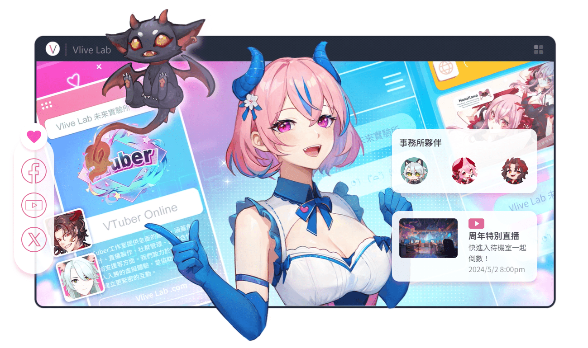

# Vlive Lab Redesign
這是 VTuber 事務所 Vlive Lab 的概念形象網站。

🔎 網站連結：
1. [CSR 版本](https://querlemtle.github.io/vl-redesign/)
2. [SSR 版本](https://vl-redesign.vercel.app/)

- 設計 & 插圖：[tata](https://github.com/tatafriend)
- 切版 & 程式：[Wtz](https://github.com/querlemtle)

## 特色
- 吸引人的手繪插圖
- 有趣的互動效果
- 可選購周邊商品的線上商店
- 閱覽 VTuber 相關最新消息

## 開發使用技術
- React (React Router / Next.js)
- CSS Modules
- PostCSS
- webpack
- GSAP
- MongoDB
- Swiper

完整列表請見 [package.json](package.json)。

## 功能導覽
- 首頁 (Home) 可概覽網站各頁主題
- 關於 (About) 頁面可查看事務所介紹
- 旗下藝人 (Talent) 頁面可查看 Vlive Lab 旗下 VTuber 的背景故事與相關社群連結
- 最新消息 (News) 頁面可獲取 VTuber 領域相關資訊
- 商店 (Shop) 可以選購獨家周邊商品
  - 點選商品卡片查看該商品的規格詳情
  - 在商品詳情頁面可選擇規格、數量，並點擊「加入購物車」將商品放入購物車中
  - 點擊頁面右下角的購物車圖示，可以查看目前購物車內容
  - 購物車頁面可以刪除不要的商品，並即時更新訂單金額
  - 點選「前往結帳」可填寫資料送出訂單
  - 結帳表單會檢查輸入內容並即時提醒使用者

## 授權
專案程式碼採用 [MIT 授權](https://opensource.org/license/MIT)釋出。

本專案中的圖片與影像，除了最新消息文章的封面圖之外，採用[創用 CC 姓名標示-非商業性-禁止改作條款（CC BY-NC-ND 4.0）](https://creativecommons.org/licenses/by-nc-nd/4.0/deed.zh-hant)。

Vlive Lab 保留其商標及旗下 VTubers 一切版權，本專案經同意授權後使用。
